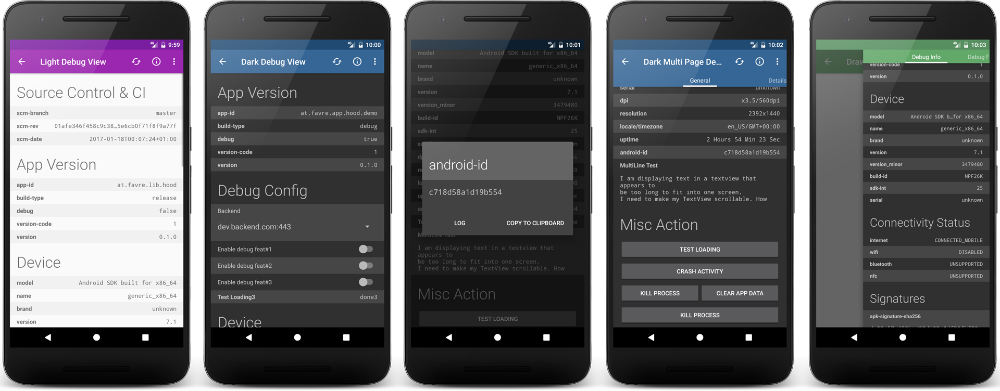
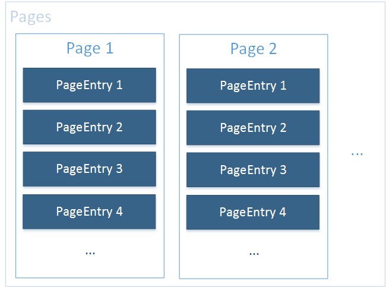
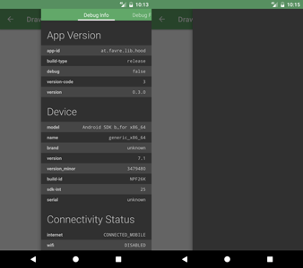

# Under the Hood - Android App Debug View Library

Under the Hood is a flexible and powerful Android debug view library. It
uses a modular template system that can be easily extended to your needs,
although coming with many useful elements built-in. There is a lot of
"default" debug data that can be easily embedded (e.g. current runtime-permission
status, app version and device info). There are 2 basic themes (dark and light)
which can be customized to your needs.
The lib is divided into 2 modules: `hood-core` containing the basic view that
can be embedded anywhere and `hood-extended` which comes with a ready-to-use
activity with a lot of convenience features. The lib has also a null-safe
[no-op](https://en.wikipedia.org/wiki/NOP) flavor indented to be used in release builds, disabling all debug features
without error-prone if-debug chains.

[ ](https://bintray.com/patrickfav/maven/hood-extended/_latestVersion)
[ ](https://bintray.com/patrickfav/maven/hood-core/_latestVersion)
[](https://travis-ci.org/patrickfav/under-the-hood)
[](https://android-arsenal.com/details/1/5131)
[](https://play.google.com/store/apps/details?id=at.favre.app.hood.demo)

To check it out, [download the demo app from the Playstore](https://play.google.com/store/apps/details?id=at.favre.app.hood.demo) . Lib and demo app require SDK 14+.

## Features

* Extensible template based view including property, button, switch and spinner views
* Extensible dark and light theme
* Plentiful default debug data (app version, permissions, system features, etc.)
* Use as activity or standalone view embeddable into your layouts
* Lightweight and uses minimal dependencies using core module
* [No-op](https://en.wikipedia.org/wiki/NOP) flavor of the lib for your release build
* Shake listener and Multi Click Listener



## Quick Start

Add the following to your dependencies ([add jcenter to your repositories](https://developer.android.com/studio/build/index.html#top-level) if you haven't)

```gradle
    dependencies {
        compile 'at.favre.lib.hood:hood-extended:0.4.2'
    }
```

Create an activity and extend `PopHoodActivity`. Define it in your `AndroidManifest`:

```xml
    <activity
        android:name="com.example.your.MyDebugActivity"
        android:theme="@style/HoodThemeDark">
    </activity>
```
Implement the config and page setter in the `Activity`:

```java
    public class MyDebugActivity extends PopHoodActivity {
        @Override
        public Pages getPageData(@NonNull Pages pages) {
            Page firstPage = pages.addNewPage();
            firstPage.add(Hood.get().createHeaderEntry("System Features"));
            firstPage.add(Hood.get().createPropertyEntry("The Key", "The value"));
            firstPage.add(DefaultProperties.createSectionBasicDeviceInfo());
            firstPage.add(Hood.get().createActionEntry(DefaultButtonDefinitions.getGlobalSettingsAction()));
            firstPage.add(new PackageInfoAssembler(PackageInfoAssembler.Type.PERMISSIONS, PackageInfoAssembler.USES_FEATURE).createSection(this, true));

            return pages;
        }

        @Override
        public Config getConfig() {
            return Config.newBuilder().setLogTag("MyDebugActivity").build();
        }
    }
```

See demo app for extended samples.

### Using only the View

Add the view to your layout:

```xml
    <at.favre.lib.hood.view.HoodDebugPageView
            android:id="@+id/debug_view"
            android:layout_width="match_parent"
            android:layout_height="match_parent"
            android:theme="@style/CustomHoodViewOverlayDark" />
```

Create the following style:

```xml
    <style name="CustomHoodViewOverlayDark" parent="ThemeOverlay.AppCompat.Dark">
        <item name="android:background">?android:windowBackground</item>
        <item name="hoodZebraColor">@color/hoodlib_zebra_color_dark</item>
        <item name="hoodTextSizeNormal">@dimen/hoodlib_standard_text_size</item>
        <item name="hoodTextSizeHeader">@dimen/hoodlib_header_text_size</item>
        <item name="hoodViewpagerTabTextColor">@android:color/primary_text_dark</item>
        <item name="hoodViewpagerTabBackgroundColor">?attr/colorPrimary</item>
    </style>
```

Set up in your controller (`Activity` or `Fragment`):

```java
    HoodDebugPageView debugView = (HoodDebugPageView) findViewById(R.id.debug_view);

    Pages pages = Hood.get().createPages(Config.newBuilder().setShowHighlightContent(false).build());
    Page firstPage = pages.addNewPage("Debug Info");
    firstPage.add(Hood.get().createActionEntry(DefaultButtonDefinitions.getCrashAction()));
    ...
    Page secondPage = pages.addNewPage("Debug Features");
    secondPage.add(DefaultProperties.createSectionConnectivityStatusInfo(this));
    secondPage.add(new PackageInfoAssembler(PackageInfoAssembler.Type.APK_INSTALL_INFO, PackageInfoAssembler.Type.PERMISSIONS).createSection(this, true));
    ...
    debugView.setPageData(pages);
```

## The HoodAPI

The main interface of the App is the `HoodAPI` or `HoodAPI.Extension` accessed
through the `Hood` singleton. It is required to use these interfaces to take
advantage of using the no-op flavor.

The interface is used with the `Hood` singleton:

    Hood.get().*
    Hood.ext().*

For default properties/actions/etc checkout the classes in

    at.favre.lib.hood.util.defaults.*

as well as `PackageInfoAssembler`.

### The DebugView

Responsible for rendering and the main interface for the Activity/Fragment
to the debug pages is the `HoodDebugPageView`. Define it in your view

    <at.favre.lib.hood.view.HoodDebugPageView
        ...
    />

For themes see section below.

To initialize the view it needs a `Pages` object:

    debugView.setPageData(pages);

If there is more than 1 page the pages are rendered in a `ViewPager` with
simple tabs on top, otherwise it will just show as a single page.

With

    debugView.refresh()

the entries can be refreshed (see `DynamicValue`). To block the view and
show a progress bar you can use:

    debugView.setProgressBarVisible(true)

Note that your Activity should implement `IHoodDebugController` to enable
all features. This is necessary so external ui elements (like DialogFragments)
can communicate with the debug view.

### Config

The config object must be created with the provided builder:

    Config.newBuilder() (...) .build()

Following configs can be changed:

* showing zebra pattern in ui (coloring every odd row)
* automatically log all of the entries in the view
* automatically refresh the view after x ms
* set your log tag for all logging features
* show tab indicator if more than 1 page

### Template Concept

The template has the following main components

* `Pages` is responsible for creating and managing a collection of `Page`
and contains the main config
* `Page` is responsible for managing a list of `PageEntry`
* `PageEntry` is a row displaying content in a `Page`. PageEntry is
responsible for how its data is rendered in the UI.



Additionally there is an element that groups a bunch of `PageEntry` entries
with additional convenience logic, like displaying an optional error message.

Creating a simple page is easy:

```java
    Pages pages = Hood.get().createPages(Config.newBuilder().build());
    Page firstPage = pages.addNewPage("Title Page 1");
    firstPage.add(...);
    ...

    Page secondPage = pages.addNewPage("Title Page 2");
    secondPage.add(...);
    ...
```

`PageEntry` elements, that can be added to a `Page` can be created like this:

```java
    page.add(Hood.get().createHeaderEntry(...))
    page.add(Hood.get().createPropertyEntry(...))
    page.add(Hood.get().createActionEntry(...))
    page.add(Hood.get().createSwitchEntry(...))
    page.add(Hood.get().createSpinnerEntry(...))
```

### Built-In PageEntry Elements

#### Property Entry


Create with:

```java
    Hood.get().createPropertyEntry("The Key", "The value")
```
Will render a row with a the key string on the one side and the value on
the other. Supports dynamic values (ie. every refresh will be reevaluated),
multi-line layout for longer values and custom on-tap-actions and background
 evaluating values.

For example a property element that will show the uptime (which will get
 update if the DebugView will be refreshed) and a toast message
when the user clicks on it:

```java
    Hood.get().createPropertyEntry("uptime", new DynamicValue<String>() {
            @Override
            public String getValue() {
                return HoodUtil.millisToDaysHoursMinString(SystemClock.elapsedRealtime());
            }
        }, Hood.ext().createOnClickActionToast(),false);
```
If you want the lib to evaluate the value in background instead of the main
thread use `DynamicValue.Async` instead of `DynamicValue`

Default actions are: Toast, Dialog, Start-Intent and ask runtime permission.

For a lot of default data, e.g. device info, set permissions and build data,
see `DefaultProperties.*` and `PackageInfoAssembler`

#### ActionEntry


Will be rendered as a simple button starting a custom action on click.
Supports single and double column actions (ie. having two buttons in the same row)

Here is a simple example:

```java
    Hood.get().createActionEntry(new ButtonDefinition("Click me", new OnClickAction() {
            @Override
            public void onClick(View v, Map.Entry<CharSequence, String> value) {
                Toast.makeText(v.getContext(), "On button clicked", Toast.LENGTH_SHORT).show();
            }
        }));
```
For a lot of default actions, e.g. android settings, app-info or uninstall
and kill process, see `DefaultButtonDefinitions` class.

#### ConfigBoolEntry & ConfigSpinnerEntry

For interactive debug features the standard implementations for switches
and spinner can be used. The logic for the switch can be anything that
implements the `ChangeableValue` interface. Spinner can also be customized
to your demands.

For a simple switch that changes a boolean in the shared preference see
this example:

```java
    Hood.get().createSwitchEntry(
        DefaultConfigActions.getBoolSharedPreferencesConfigAction(
            getPreferences(MODE_PRIVATE),
            "SHARED_PREF_KEY", "Enable debug feat#1", false));
```


This code will create a simple backend switcher:

```java
    Hood.get().createSpinnerEntry(
        DefaultConfigActions.getDefaultSharedPrefBackedSpinnerAction(
        "Backend", getPreferences(MODE_PRIVATE),
        "BACKEND_ID", null, getBackendElements())));

    private List<SpinnerElement> getBackendElements() {
       //return your backends
    }
```


There is a standard implementation for `ConfigBoolEntry` in `DefaultConfigActions`
 backed by shared preferences.

#### Header and Message

Group your entries with a header

```java
    Hood.get().createHeaderEntry("App Version")
```


To display a simple message use the following:

```java
    Hood.get().createSimpleMessageEntry("This is a simple message shown in ui")
```
### Custom PageEntries

A `PageEntry` must implement the interface with the same name. It holds
a distinct value, can be refreshed and returns a loggable string. The most
important part, though, is the `ViewTemplate` that defines how this entry
is rendered. The `constructView` and `setContent` are similar to the
`onCreateViewHolder` and `onBindViewHolder` in a `RecyclerView`. It is important
that `ViewTemplate` must return a distinct type as int (values over 65536 are
reserved by the lib)

## Library Modules and Flavours

The library comes in 2 modules:

### Module `hood-core`
Contains only the base code without the default implementation of the debug activity.
The advantage is that there is only minimal dependencies on `support*` libraries and
therefore very lightweight, not adding too much methods or `res` to your app.

The core module comes in 2 flavours (or classifier):

#### `release`
The standard version of the lib with all features. You could use this
version in only in your debug builds with:
```gradle
    compile("at.favre.lib.hood:hood-core:x.x.x")
```
#### `noop`
The [no-op version](https://en.wikipedia.org/wiki/NOP) of the lib internally using null-safe no-op versions of the
main template system. All creator methods of `HoodAPI` (`Hood.get()`) and `HoodAPI.Extension`
(`Hood.ext()`) support the no-op switch and return dummy implementations.
If you use implementation from `at.favre.lib.hood.page.**` directly this will have no effect.

Here is a piratical example to use default flavor in debug and noop in release:
```gradle
    debugCompile('at.favre.lib.hood:hood-core:x.x.x')
    releaseCompile(group: 'at.favre.lib.hood', name: 'hood-core', version: 'x.x.x', classifier: 'noop', ext: 'aar', transitive: true)
```
The `PopHoodActivity` will also respect the no-op switch and just finish.
 The no-op state can be checked with `Hood.isLibEnabled()` from any caller.

Here is a example of a noop view being rendered



### Module `hood-extended`

Extends the `hood-core` with a default implementation of a debug activity
using `appcompat-v7` support library.

If you want to use the noop version in release use something like this:
```gradle
    debugCompile('at.favre.lib.hood:hood-extended:x.x.x')
    releaseCompile('at.favre.lib.hood:hood-extended:x.x.x') {
            exclude group: 'at.favre.lib.hood', module: 'hood-core'
            releaseCompile(group: 'at.favre.lib.hood', name: 'hood-core', version: 'x.x.x',
            classifier: 'noop', ext: 'aar', transitive: true)
    }
```
## Theme

The lib defines some required attributes, so they need to be set in order
to be able to render the view. The easiest way is to use the build-in themes
(`hood-extended`) for Activities (which extend from `Theme.AppCompat`)

* `HoodThemeLight`
* `HoodThemeDark`

and overlays for standalone views:

* `HoodLibThemeOverlay.Dark`
* `HoodLibThemeOverlay.Light`
* `HoodLibThemeOverlay.Dark.Small`
* `HoodLibThemeOverlay.Light.Small`

You can also define your own theme (extending `Theme.AppCompat` or `ThemeOverlay.AppCompat`)
but you must define the following attributes in it:

* `hoodToolbarTextColor`: toolbar text and icon color
* `hoodZebraColor`: highlighting color for odd rows
* `hoodTextSizeNormal`: default text size
* `hoodTextSizeHeader`: header text size
* `hoodViewpagerTabTextColor`: text color pager tabs labels (only relevant for 2+ pages)
* `hoodViewpagerTabBackgroundColor`: background of pager tabs (only relevant for 2+ pages)

Here is an example with useful defaults:
```xml
    <style name="HoodThemeDark" parent="Theme.AppCompat.NoActionBar">
        ...
        <item name="hoodToolbarTextColor">@android:color/primary_text_dark</item>
        <item name="hoodZebraColor">@color/hoodlib_zebra_color_dark</item>
        <item name="hoodTextSizeNormal">@dimen/hoodlib_standard_text_size</item>
        <item name="hoodTextSizeHeader">@dimen/hoodlib_header_text_size</item>
        <item name="hoodViewpagerTabTextColor">@android:color/primary_text_dark</item>
        <item name="hoodViewpagerTabBackgroundColor">?attr/colorPrimary</item>
    </style>
```
## Additional Features

### Using the Shake Detector to open the Debug View

Use the HoodAPI.Extension interface to register your intent:
```java
    shakeControl = Hood.ext().registerShakeToOpenDebugActivity(this,
        PopHoodActivity.createIntent(this, MyDebugActivity.class));
```
Then start/stop the detector `onResume()`/`onPause()`
```java
    @Override
    protected void onResume() {
        super.onResume();
        shakeControl.start();
    }

    @Override
    protected void onPause() {
        super.onPause();
        shakeControl.stop();
    }
```
### Using the Arbitrary Tap ClickListener

If you want to obfuscate the access point of your debug view with e.g.
a triple click on a view that does not look clickable use the following code:
```java
    myView.setOnTouchListener(Hood.ext().createArbitraryTapListener(3, new View.OnClickListener() {
            @Override
            public void onClick(View v) {
                PopHoodActivity.start(WrappingActivity.this, MyDebugActivity.class);
            }
     }));
```

## Possible conflicts and things to mind

This lib uses [Timber](https://github.com/JakeWharton/timber) lib, but will
 only add `DebugTree` if there is none found (added the first time the Hood
 singleton is called).

 All `res` assets are prefixed with `hoodlib_` so there should be no conflict
 when merging the resources.

## Proguard

The lib includes it's own proguard consumer rules and should work out of
the box with obfuscated builds.

## Recipes

### Suggestions on what Properties/Actions to add to your Page

Apart from `DefaultProperties` the following could be useful:

> git-hash, git-branch, CI build no, build time, login-data, internal states

The following debug actions might be useful:

> clear (image) caches, manually calling requests, updating ui, changing shared pref states, directly open activities

### Start your debug activity through adb

Add `android:exported="true"` to your activity definition and use the following adb call:

     adb shell am start -n com.example.your.app-id/com.example.your.app.pacakge.DebugActivity

### Have certain debug features only in debug builds

Use a static boolean (e.g. `BuildConfig.DEBUG`) in an if like

    if(BuildConfig.DEBUG) {
        page.addAction(...)
    }
    
Although verbose, the advantage is that the compiler will remove the unreachable code in release builds similar to using C macros.

## Build

Assemble the lib with the following command

    ./gradlew :hood-core:assemble
    ./gradlew :hood-extended:assemble
    
The `.aar` files can then be found in `/hood-*/build/outputs/aar` folder

## Libraries & Credits

* [Timber](https://github.com/JakeWharton/timber)
* [Seismic](https://github.com/square/seismic)
* [Icon by Freepik](http://www.flaticon.com/free-icon/nut_264316#term=nut&page=1&position=8)

## Similar Projects:

* [Bee - Debug and QA tool for android](https://github.com/orhanobut/bee)
* [DebugDrawer - Android Debug Drawer for faster development](https://github.com/palaima/DebugDrawer)
* [debugdrawer - Debug Drawer for android debug builds](https://github.com/williamwebb/debugdrawer)

# License

Copyright 2017 Patrick Favre-Bulle

Licensed under the Apache License, Version 2.0 (the "License");
you may not use this file except in compliance with the License.
You may obtain a copy of the License at

    http://www.apache.org/licenses/LICENSE-2.0

Unless required by applicable law or agreed to in writing, software
distributed under the License is distributed on an "AS IS" BASIS,
WITHOUT WARRANTIES OR CONDITIONS OF ANY KIND, either express or implied.
See the License for the specific language governing permissions and
limitations under the License.